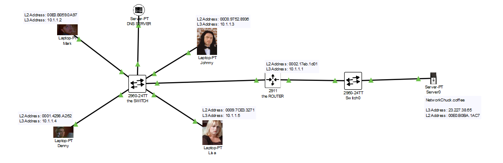

## What is a Router?
A **router** is a network device that connects **different networks together** and routes data from one network to another — usually from your local network (LAN) to the internet (WAN).
It determines the **best path** for data packets to travel and forwards them accordingly.
## How It Works
- Operates at **Layer 3 (Network Layer)** of the OSI model.
- Uses **IP addresses** (not MAC addresses like switches).
- Maintains a **routing table** to decide the next hop for each packet.
## Key Functions
- Routes data between different IP networks (e.g., your home and the internet).
- Provides **Network Address Translation (NAT)** to allow multiple devices to share one public IP.
- Often includes a **firewall** for basic security.
- Assigns local IPs using **DHCP** (in home routers).
## Real-World Use
- In homes: connects your devices to the internet via Wi-Fi or Ethernet.
- In businesses: connects branch offices or data centers.
- In ISPs: routes traffic across the internet backbone.
## Example
When you open a website, your router:
1. Sends your request to the ISP.
2. The ISP routes it to the destination server.
3. The server responds, and the data returns through the router to your device.
## Diagram
 
